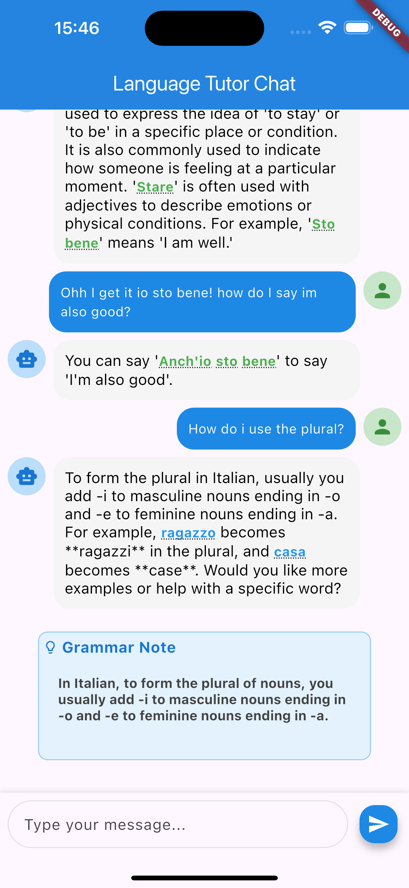
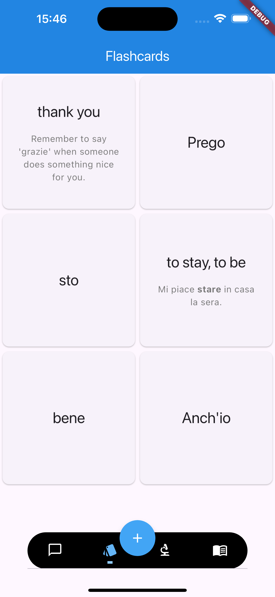
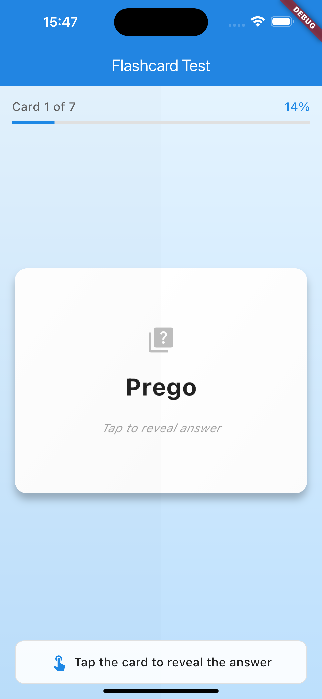
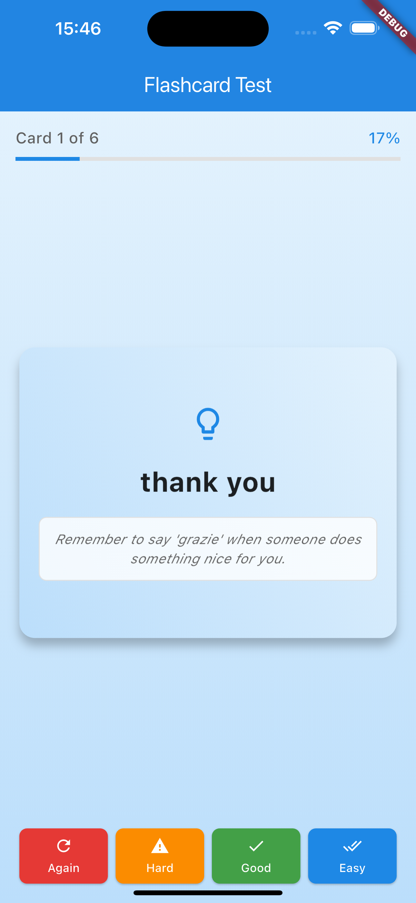

# Language Tutor App (Flutter)

This is a Flutter-based language learning application designed to help users learn Italian through interactive conversations and AI-driven flashcard generation. The app uses OpenAI’s GPT models to act as a conversational tutor and incorporates a spaced repetition system (SRS) to reinforce vocabulary and grammar.

## Features
- AI tutor with adaptive bilingual conversations (Italian ↔ English)
- Inline vocabulary support with tappable flashcards
- Grammar notes extracted and stored for later review
- Spaced repetition scheduling (FSRS algorithm)
- Chat history and session tracking
- SQLite-backed flashcard storage
- Clean architecture with BLoC state management

## Getting Started

### Prerequisites
	•	Flutter SDK
	•	Dart SDK

### Install Dependencies

flutter pub get

API Key Setup

The application uses the OpenAI API. To enable this, you currently must provide your API key.
	1.	Create a .env file in the root of your project.
	2.	Add the following:

OPENAI_API_KEY=your_openai_api_key_here

Note: This key is not included in version control. Make sure you do not check your .env file into GitHub.

Run the App

flutter run

## Screenshots

  
  

  
  

<!-- Add your screenshots below -->

## Roadmap
- Optional User auth and cloud sync (with subscription model) or free use with own API-Key
    - Deployment of V1
- Multi-language support

## License

This project is licensed under the MIT License.

---

Feel free to contribute or open issues for suggestions or bugs!a